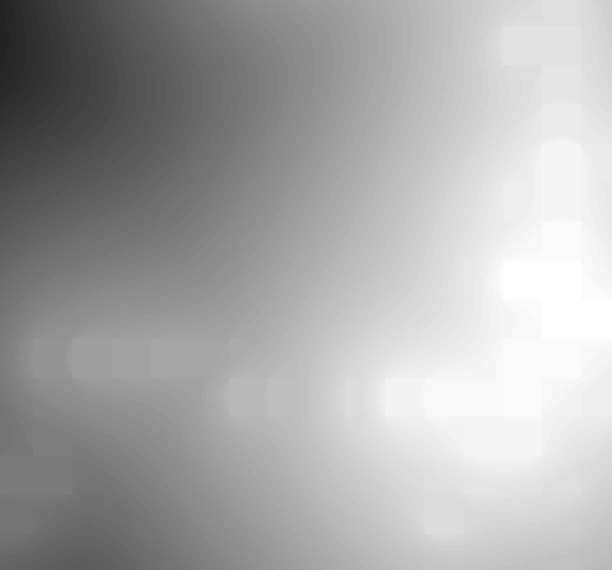
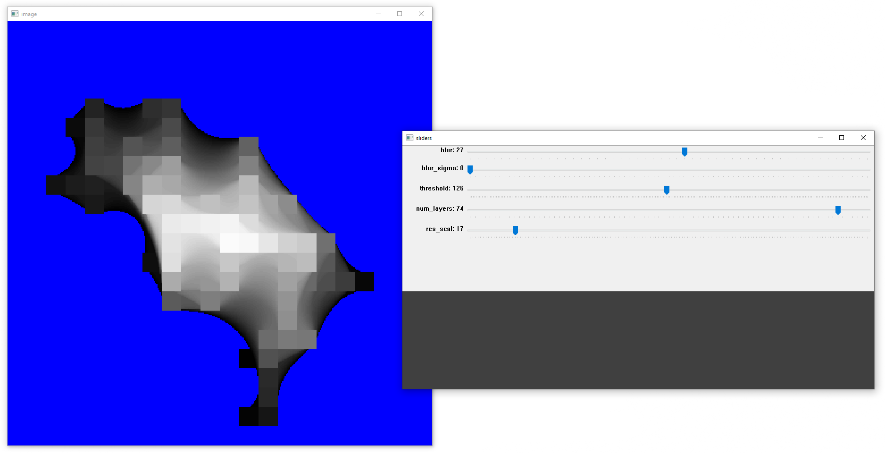
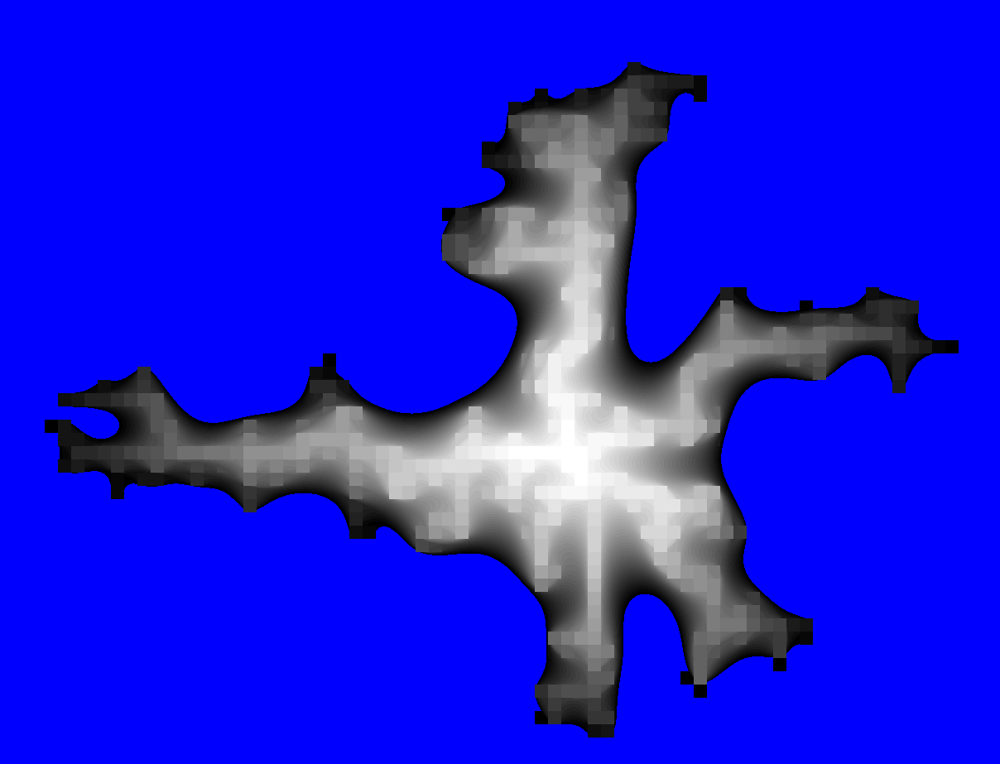
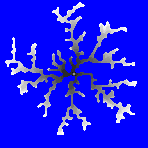
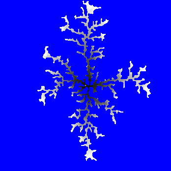

# Step 6: Creating image layers and converting to SVG

## Description
- Lots of things got implemented here.
- Saved raster image layer at each step. 
- Convert those raster images to vector images using the vtracer library. 
- Scaled and formatted those SVG images using the svgpathtools python library.
	- Scaled the values of all the vertices. The final size was 1 pixels = 0.33 cm
	- Removed outer path that was the outer border of the image
	- Set the fill to white
	- Set the stroke color to red
- Figured out how to get a good preview in blender, which helped a lot for visualizing. Originally I tried to use blender to preview the layers with the height displacing a grid with the raster image. That didn't work very well. 
- Made cv2 GUI for live previewing of the parameters. This only worked for small images/trees but was helpful to understand how to the parameters effect the image. 

## CV2 UI for tuning parameters
I used the simple UI provided with CV2 to make a program that would allow me to preview different settings for the blur, resolution, etc. 

# Close ups of raster to SVG conversion. 

## Next Step
[Step 7: Optimizing with Numba](https://github.com/jj-gagnon/CART-263-DLA/tree/step-7-optimizing-with-numba)

## Table of Contents
[Step 1: Simple and slow](https://github.com/jj-gagnon/CART-263-DLA/tree/step-1-simple-and-slow)

[Step 2: Failed optimization](https://github.com/jj-gagnon/CART-263-DLA/tree/step-2-failed-optimization)

[Step 3: Spawn new particles only on bounding circle](https://github.com/jj-gagnon/CART-263-DLA/tree/step-3-spawn-points-on-circle)

[Step 4: Making the tree structure's branches have more width](https://github.com/jj-gagnon/CART-263-DLA/tree/step-4-accumulative-blurring-and-threshold)

[Step 5: Correct blurring and stacking](https://github.com/jj-gagnon/CART-263-DLA/tree/step-4-accumulative-blurring-and-threshold)

[Step 6: Creating image layers and converting to SVG](https://github.com/jj-gagnon/CART-263-DLA/tree/step-6-converting-to-image-layers-and-svg)

[Step 7: Optimizing with Numba](https://github.com/jj-gagnon/CART-263-DLA/tree/step-7-optimizing-with-numba)

[Step 8: First and second laser cut tests](https://github.com/jj-gagnon/CART-263-DLA/tree/step-8-first-and-second-test-laser-cut)

[Step 9: Finalizing the design](https://github.com/jj-gagnon/CART-263-DLA/tree/step-9-first-attempt-at-finalizing-the-design)

[Step 10: Preparing files for laser cutter](https://github.com/jj-gagnon/CART-263-DLA/tree/step-10-preparing-files)

[Step 11: Assembly](https://github.com/jj-gagnon/CART-263-DLA/tree/step-11-assembly)

[Step 12: Finished](https://github.com/jj-gagnon/CART-263-DLA/tree/step-12-finished)
