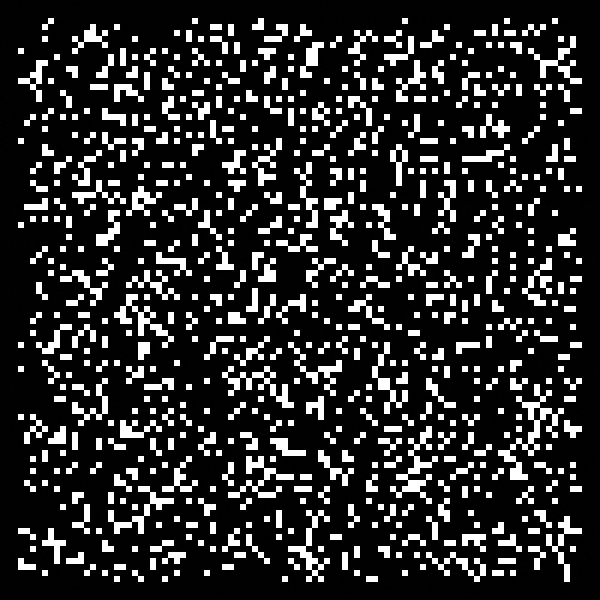
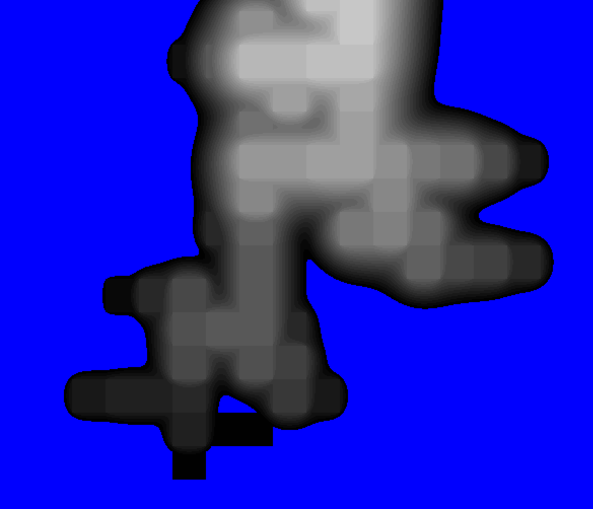

# Step 7: Optimizing with Numba

## Description
- Used the Numba library to dramatically increase the speed of the actual DLA simulation to get the initial discrete brownian tree. Sadly this required leaving the OOP approach I was using before. 
- I tried using Numba to optimize the stacking, blurring, and layering process. After much hard work and problem solving I finally got Numba working on the required functions only to find that it was much slower than just using Numpy. One of the main reasons is that Numba does not allow multidimensional indexing. So all the image arrays had to be flattened first and then reshaped over and over again. The learning lesson here is the Numba works really really well for when you have are writing nested for loops in python. But if you are already using a library that is optimized and whose backend is c/c++/rust then using Numba probably won't be much faster. 
- With Numba I could make much larger brownian trees. 

## Interesting error
Forgot to stop a particle from continuing once it has been frozen to the tree. So particles would keep drawing and make a sort of fractal and noisy path. 

Open image in a new tab to zoom in on the detail:

## Next Step
[Step 8: First and second laser cut tests](https://github.com/jj-gagnon/CART-263-DLA/tree/step-8-first-and-second-test-laser-cut)

## Table of Contents
[Step 1: Simple and slow](https://github.com/jj-gagnon/CART-263-DLA/tree/step-1-simple-and-slow)

[Step 2: Failed optimization](https://github.com/jj-gagnon/CART-263-DLA/tree/step-2-failed-optimization)

[Step 3: Spawn new particles only on bounding circle](https://github.com/jj-gagnon/CART-263-DLA/tree/step-3-spawn-points-on-circle)

[Step 4: Making the tree structure's branches have more width](https://github.com/jj-gagnon/CART-263-DLA/tree/step-4-accumulative-blurring-and-threshold)

[Step 5: Correct blurring and stacking](https://github.com/jj-gagnon/CART-263-DLA/tree/step-4-accumulative-blurring-and-threshold)

[Step 6: Creating image layers and converting to SVG](https://github.com/jj-gagnon/CART-263-DLA/tree/step-6-converting-to-image-layers-and-svg)

[Step 7: Optimizing with Numba](https://github.com/jj-gagnon/CART-263-DLA/tree/step-7-optimizing-with-numba)

[Step 8: First and second laser cut tests](https://github.com/jj-gagnon/CART-263-DLA/tree/step-8-first-and-second-test-laser-cut)

[Step 9: Finalizing the design](https://github.com/jj-gagnon/CART-263-DLA/tree/step-9-first-attempt-at-finalizing-the-design)

[Step 10: Preparing files for laser cutter](https://github.com/jj-gagnon/CART-263-DLA/tree/step-10-preparing-files)

[Step 11: Assembly](https://github.com/jj-gagnon/CART-263-DLA/tree/step-11-assembly)

[Step 12: Finished](https://github.com/jj-gagnon/CART-263-DLA/tree/step-12-finished)
