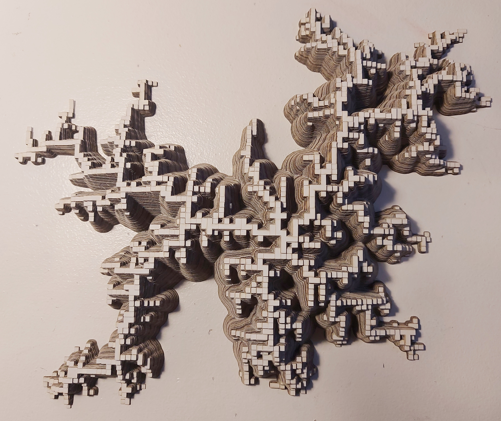
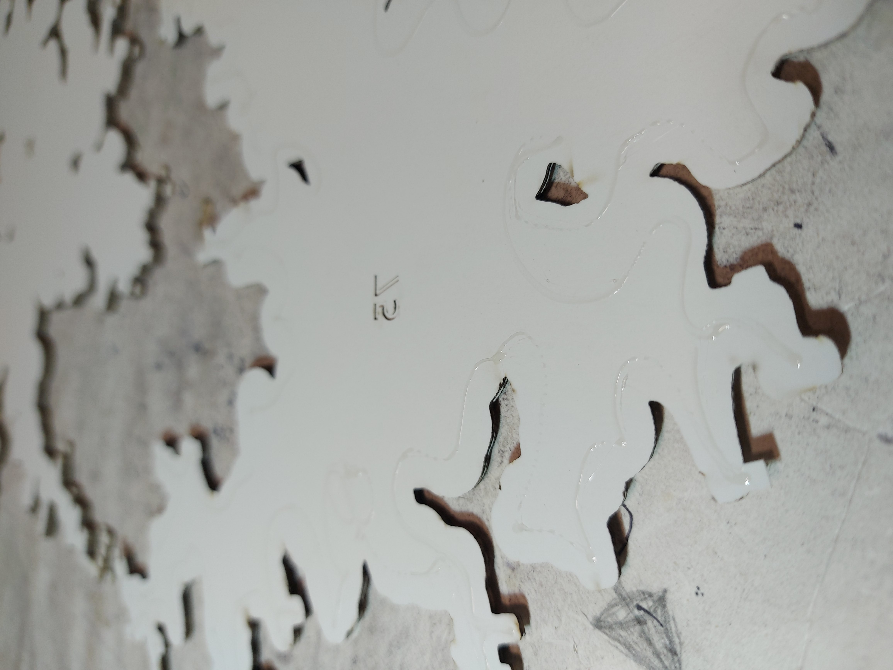
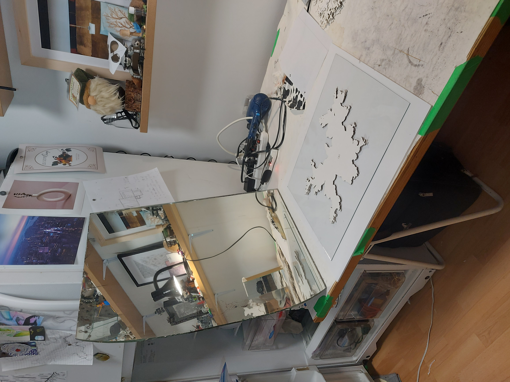
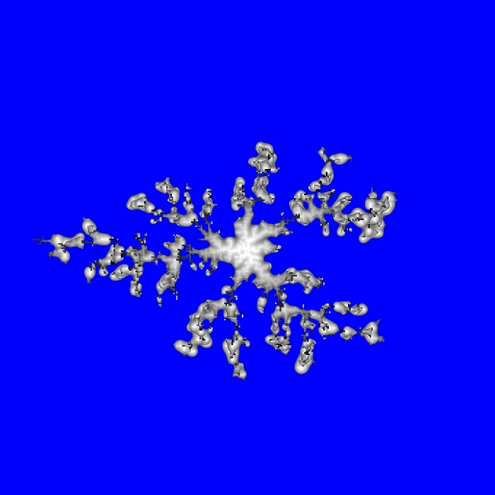
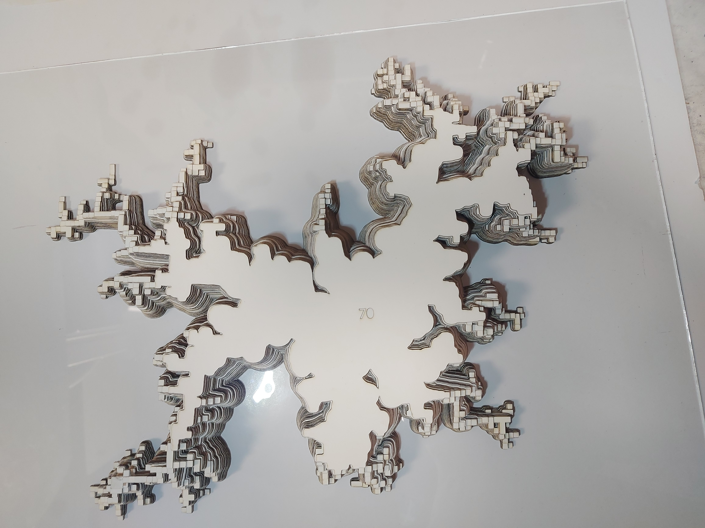
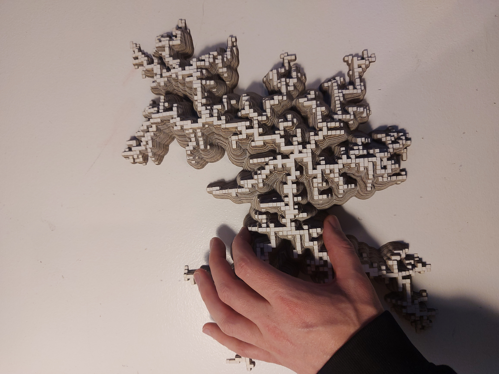

# Step 12: Finished Sculpture

## Description
I am really happy with the result!

It was taller than I was expecting it to be. 

The layers are also less consistent than I thought they would be, but I like the way it looks, more natural. 
I think there was some inconsistencies with the laser cutter as well. Some layers are darker than others. The paper was also a little strange. About half the pieces had a much warmer color tone of white. I'm not sure if I bought them like that or somehow that happened in the cutting process. 

I think I'm might put a hole in the back as well so that I can hang it on a wall. 

## Table of Contents
[Step 1: Simple and slow](https://github.com/jj-gagnon/CART-263-DLA/tree/step-1-simple-and-slow)

[Step 2: Failed optimization](https://github.com/jj-gagnon/CART-263-DLA/tree/step-2-failed-optimization)

[Step 3: Spawn new particles only on bounding circle](https://github.com/jj-gagnon/CART-263-DLA/tree/step-3-spawn-points-on-circle)

[Step 4: Making the tree structure's branches have more width](https://github.com/jj-gagnon/CART-263-DLA/tree/step-4-accumulative-blurring-and-threshold)

[Step 5: Correct blurring and stacking](https://github.com/jj-gagnon/CART-263-DLA/tree/step-4-accumulative-blurring-and-threshold)

[Step 6: Creating image layers and converting to SVG](https://github.com/jj-gagnon/CART-263-DLA/tree/step-6-converting-to-image-layers-and-svg)

[Step 7: Optimizing with Numba](https://github.com/jj-gagnon/CART-263-DLA/tree/step-7-optimizing-with-numba)

[Step 8: First and second laser cut tests](https://github.com/jj-gagnon/CART-263-DLA/tree/step-8-first-and-second-test-laser-cut)

[Step 9: Finalizing the design](https://github.com/jj-gagnon/CART-263-DLA/tree/step-9-first-attempt-at-finalizing-the-design)

[Step 10: Preparing files for laser cutter](https://github.com/jj-gagnon/CART-263-DLA/tree/step-10-preparing-files)

[Step 11: Assembly](https://github.com/jj-gagnon/CART-263-DLA/tree/step-11-assembly)

[Step 12: Finished](https://github.com/jj-gagnon/CART-263-DLA/tree/step-12-finished)
