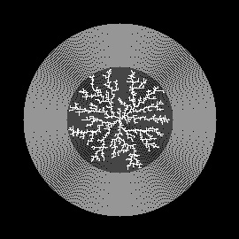

# Step 4: Making the tree structure's branches have more width

## Description
- The idea here is that tree is broken up into layers, where each layer represents the tree at a certain stage of growth. By blurring and image then applying a threshold operation, you can make a shape bigger. This is what I do here. The trick is that each new particle (pixel) added to the tree gets blurred increasingly after it is added. 
