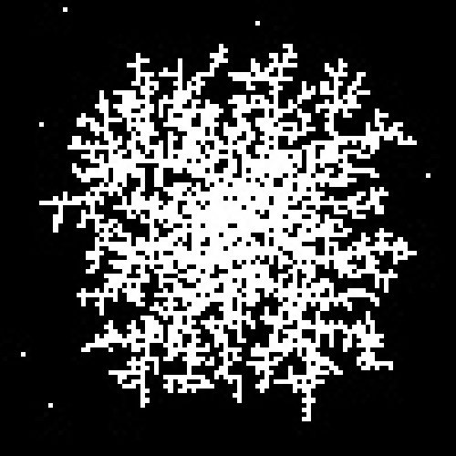

# Step 2: Failed Optimization

#Description
The plan here was to limit the range that the particles would sapwn away from the tree. Because if they were far away it could take a long time for them to wander closer. 

Also I would only wait a certain amount of time before remove all wondering points and spawning a new batch. This would also prevent particles from wondering too far away. 

The problem was that I was spawning particles in a square around the center, and so they would spawn inside the tree instead of on the outside so that they can wonder in. 
