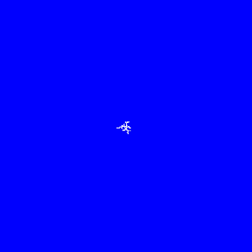

# Step 4: Making the tree structure's branches have more width

## Description
- The idea here is that tree is broken up into layers, where each layer represents the tree at a certain stage of growth. By blurring and image then applying a threshold operation, you can make a shape bigger. This is what I do here. The trick is that each new particle (pixel) added to the tree gets blurred increasingly after it is added. 
- That was the goal but in this implementation there was some kind of 8 bit overflow error when trying to make larger images. The error looks cool though so I put them in here:
- Had to increase the resolution of the images to allow to blur to act more smoothly. 

## Interesting error 1
### This one was due to an 8 bit overflow

## Interesting error 2
### This one occured when I messed up the order of operations for the blurring and stacking of layers

