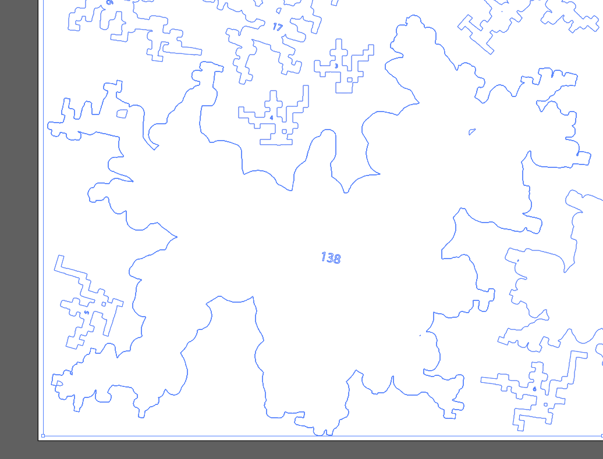

# Step 10: Preparing files for laser cutter. 

## Description
- Manually nested and labeled 140 SVG files into 16 Adobe Illustrator files. This took a long time. 
- I was going to manually label them when they were done being cut, but I thought it would be easier to just have the laser cut cut the labels. Oddly it was very difficult to try and get a monoline path for text in illustrator. Instead the text has to be cut on the inside and outside edge, which feels frustratingly unnecessary. 

