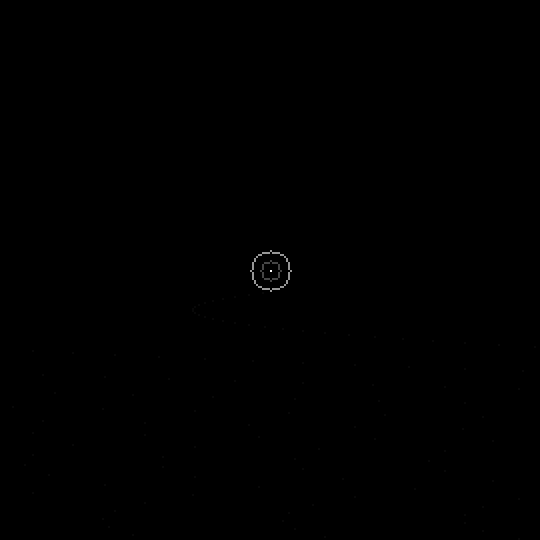
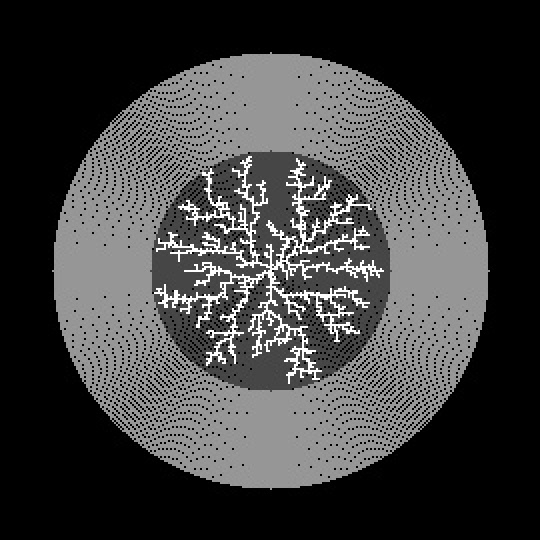

# Step 3: Spawn new particles only on bounding circle

# Description
- Animation no longer shows the random motion of the particles. Only the tree as more particles stick to it. 
- Spawn new particles randomly along a circle that is just bigger than the tree structure and gets larger as the tree grows. Which is colored in dark grey in the gif above. 
- There is now a despawn radius which if a particle wanders past it will be deleted. This is colored in light grey in the gif above. 
- These optimizations made a big difference. 

## Next Step
[Step 4: Making the tree structure's branches have more width](https://github.com/jj-gagnon/CART-263-DLA/tree/step-4-accumulative-blurring-and-threshold)

## Table of Contents
[Step 1: Simple and slow](https://github.com/jj-gagnon/CART-263-DLA/tree/step-1-simple-and-slow)

[Step 2: Failed optimization](https://github.com/jj-gagnon/CART-263-DLA/tree/step-2-failed-optimization)

[Step 3: Spawn new particles only on bounding circle](https://github.com/jj-gagnon/CART-263-DLA/tree/step-3-spawn-points-on-circle)

[Step 4: Making the tree structure's branches have more width](https://github.com/jj-gagnon/CART-263-DLA/tree/step-4-accumulative-blurring-and-threshold)

[Step 5: Correct blurring and stacking](https://github.com/jj-gagnon/CART-263-DLA/tree/step-4-accumulative-blurring-and-threshold)

[Step 6: Creating image layers and converting to SVG](https://github.com/jj-gagnon/CART-263-DLA/tree/step-6-converting-to-image-layers-and-svg)

[Step 7: Optimizing with Numba](https://github.com/jj-gagnon/CART-263-DLA/tree/step-7-optimizing-with-numba)

[Step 8: First and second laser cut tests](https://github.com/jj-gagnon/CART-263-DLA/tree/step-8-first-and-second-test-laser-cut)

[Step 9: Finalizing the design](https://github.com/jj-gagnon/CART-263-DLA/tree/step-9-first-attempt-at-finalizing-the-design)

[Step 10: Preparing files for laser cutter](https://github.com/jj-gagnon/CART-263-DLA/tree/step-10-preparing-files)

[Step 11: Assembly](https://github.com/jj-gagnon/CART-263-DLA/tree/step-11-assembly)

[Step 12: Finished](https://github.com/jj-gagnon/CART-263-DLA/tree/step-12-finished)
